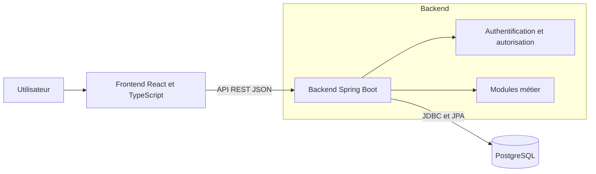
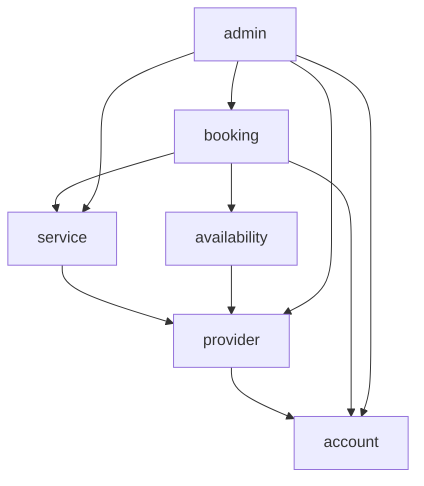
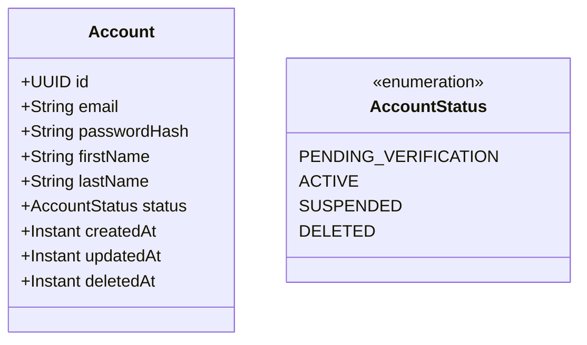

# Architecture de ProxiLink

## 1. Objectif du document

Ce document décrit l’architecture initiale de ProxiLink, une plateforme locale de mise en relation entre des particuliers et des prestataires de services.

Il présente les principaux composants du système, leurs responsabilités, leurs interactions ainsi que les décisions techniques retenues pour construire le MVP.

## 2. Périmètre architectural

L’architecture initiale couvre le MVP de ProxiLink :

- la création et l’authentification des comptes ;
- la gestion des profils utilisateurs et prestataires ;
- la publication et la recherche de services par mot-clé et par catégorie, sans recherche géographique ni calcul de distance dans le MVP ;
- la gestion des disponibilités ;
- la création et le suivi des réservations ;
- l’administration essentielle de la plateforme.

La messagerie, le paiement en ligne, les commissions, les évaluations avancées, le chatbot et l’application mobile ne font pas partie de cette première architecture. Ils pourront être intégrés progressivement dans des versions ultérieures.

## 3. Style architectural

ProxiLink adopte une architecture en monolithe modulaire.

L’application est déployée comme une seule unité, mais son code est organisé en modules fonctionnels clairement séparés. Chaque module possède ses responsabilités et ne peut accéder aux autres modules qu’à travers leurs interfaces publiques.

Les frontières et les dépendances entre modules seront vérifiées automatiquement avec Spring Modulith et un test d’architecture exécuté dans le pipeline CI.

Les raisons de ce choix, les alternatives envisagées et les critères de réévaluation sont documentés dans l’[ADR 0001](decisions/0001-utiliser-un-monolithe-modulaire.md).

## 4. Vue générale des composants

Le frontend fournit l’interface utilisateur. Il communique avec le backend au moyen d’une API REST utilisant JSON. Le backend applique les règles métier, gère la sécurité et stocke les données dans PostgreSQL.

## 5. Organisation fonctionnelle du backend

Le backend est organisé par domaine fonctionnel plutôt que uniquement par couche technique.

Les modules ont les responsabilités suivantes :

- `account` : comptes, profils, authentification et autorisations ;
- `provider` : informations propres aux prestataires ;
- `service` : publication et gestion des prestations ;
- `availability` : créneaux proposés par les prestataires ;
- `booking` : création et suivi des réservations ;
- `admin` : opérations essentielles d’administration.

Chaque flèche représente une dépendance autorisée entre deux modules.

## 6. Modèle initial du compte

Le module `account` est responsable de l’identité, de l’authentification et de l’état des comptes.

L’existence d’un `ProviderProfile` dans le module `provider` constitue la seule source de vérité permettant de savoir si un compte est prestataire. L’autorité `PROVIDER` est calculée lors du chargement du contexte de sécurité et n’est pas stockée dans `Account`.

Un compte créé possède initialement le statut `PENDING_VERIFICATION`. Il ne peut pas effectuer de réservation tant que son adresse électronique n’a pas été vérifiée.

Lorsqu’un compte est supprimé, ses données personnelles sont anonymisées :

- l’adresse électronique est remplacée par une valeur technique unique ;
- le prénom et le nom sont supprimés ;
- le mot de passe haché est supprimé ;
- le statut devient `DELETED` ;
- la date de suppression est enregistrée dans `deletedAt`.

L’identifiant du compte est conservé afin de maintenir les références nécessaires vers les réservations passées.

Les identifiants seront stockés avec le type PostgreSQL natif `uuid`. La variante de génération du UUID sera décidée après la création du projet et la vérification de la version d’Hibernate utilisée.

Les mots de passe seront hachés avec BCrypt. Le facteur de coût sera configurable et calibré sur l’environnement cible afin d’obtenir un compromis acceptable entre sécurité et temps de réponse.

## 7. Technologies principales

| Composant | Technologie | Responsabilité |
|---|---|---|
| Frontend | React et TypeScript | Interface utilisateur web |
| Backend | Java 21 et Spring Boot | API REST et logique métier |
| Gestion du build | Maven | Gestion des dépendances, compilation, tests et packaging |
| Sécurité | Spring Security | Authentification et autorisation |
| Persistance | Spring Data JPA | Accès aux données |
| Architecture modulaire | Spring Modulith | Vérification automatique des frontières et dépendances entre les modules |
| Base de données | PostgreSQL | Stockage persistant |
| Migrations | Flyway | Versionnement du schéma de base de données |
| Tests | JUnit 5, Mockito et Testcontainers | Tests unitaires et tests d’intégration |
| Couverture | JaCoCo | Mesure de la couverture du backend |
| Analyse statique | SonarCloud | Détection des problèmes de qualité et suivi de la couverture |
| Conteneurisation | Docker et Docker Compose | Environnement local reproductible |
| Déploiement | Microsoft Azure | Hébergement des environnements de démonstration et de production |
| Intégration continue | GitHub Actions | Compilation et exécution automatique des tests |
| Documentation | Markdown, Mermaid et ADR | Documentation versionnée avec le code |

Microsoft Azure constitue la plateforme cloud cible. Le service Azure précis — par exemple Azure App Service ou Azure Container Apps — sera choisi ultérieurement selon les besoins techniques, le coût, la simplicité d’exploitation et les avantages offerts par l’abonnement Azure étudiant.

Ces technologies sont retenues pour leur compatibilité avec l’architecture, leur maturité et leur adéquation avec les besoins du MVP. Les versions précises seront centralisées dans les fichiers de configuration du projet.

## 8. Utilisation des patrons de conception

Les patrons de conception ne seront pas appliqués systématiquement. Ils seront introduits uniquement lorsqu’ils répondent à un problème concret et rendent le code plus compréhensible, testable ou évolutif.

Les patrons susceptibles d’être utilisés comprennent notamment :

- **Strategy** pour sélectionner un comportement métier parmi plusieurs variantes ;
- **Specification** pour exprimer et combiner des règles métier complexes ;
- **Adapter** pour isoler les services externes du domaine ;
- **Observer ou événements de domaine** pour informer un module sans créer de dépendance directe ;
- **Factory** lorsque la création d’un objet métier nécessite plusieurs règles ou validations.

L’utilisation d’un patron devra être justifiée lorsqu’elle concerne une règle métier centrale ou une frontière entre modules. Cette justification précisera :

1. le problème rencontré ;
2. les solutions envisagées ;
3. le patron retenu ;
4. ses avantages et ses inconvénients ;
5. les tests permettant de vérifier son comportement.

Pour une utilisation locale et simple, un nom de classe explicite ou un commentaire pourra suffire. Un ADR sera réservé aux décisions ayant un impact important ou durable sur l’architecture.

L’utilisation des interfaces Spring Data JPA constitue un choix fourni par le framework et n’est pas considérée, à elle seule, comme une décision de patron de conception. Le niveau de dépendance du domaine envers Spring Data devra être décidé séparément si cette question devient structurante.

## 9. Décisions d’architecture

- [ADR 0001 — Utiliser un monolithe modulaire](decisions/0001-utiliser-un-monolithe-modulaire.md)
- [ADR 0002 — Utiliser des sessions serveur pour l’authentification](decisions/0002-utiliser-des-sessions-serveur.md)
- [ADR 0003 — Définir les relations entre modules](decisions/0003-definir-les-relations-entre-modules.md)