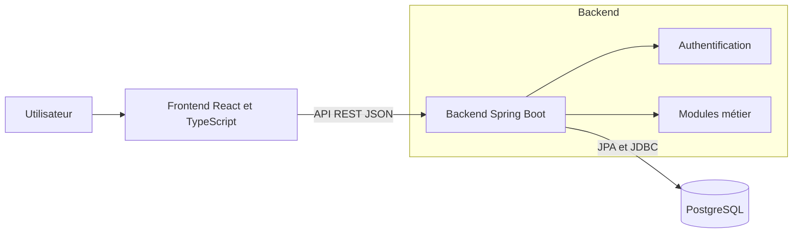
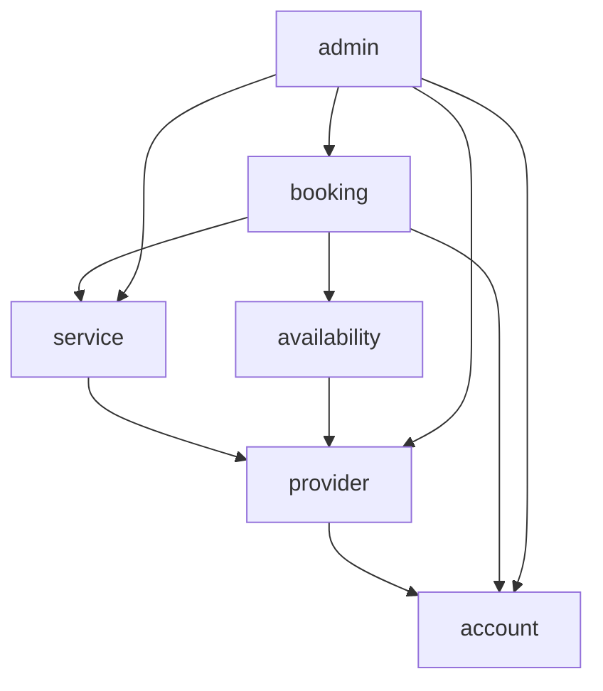
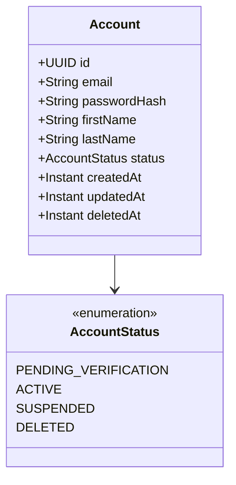

# Tâche 16 — Définir l’architecture initiale de ProxiLink

## Informations générales

- **Sprint :** Sprint 01
- **Issue GitHub :** #16
- **Pull request :** [#31](https://github.com/wankamdypuedilane/proxilink/pull/31)
- **Commit fusionné :** `e1e3f4b`
- **Composant :** Architecture et documentation
- **Statut :** terminé

## 1. Objectif

Définir une architecture initiale simple, cohérente et évolutive pour le MVP de ProxiLink.

Cette tâche devait établir le cadre technique avant le développement du backend et du frontend. L’objectif n’était pas encore d’écrire du code applicatif, mais de répondre aux questions suivantes :

- quels sont les composants principaux de ProxiLink ?
- comment communiquent-ils ?
- comment organiser le backend ?
- quelles technologies utiliser ?
- comment gérer l’authentification ?
- comment limiter les dépendances entre les modules ?
- comment documenter les futures décisions techniques ?

## 2. Préparation de l’environnement de travail

Avant la rédaction de l’architecture, le dépôt GitHub et l’environnement local ont été préparés pour travailler avec un processus proche de celui d’une entreprise.

Le travail a été réalisé dans une branche dédiée, séparée de `main`.

Le cycle utilisé était :

1. partir d’une branche `main` à jour ;
2. créer une branche correspondant à l’issue ;
3. rédiger les documents d’architecture ;
4. vérifier les modifications ;
5. publier la branche ;
6. ouvrir une pull request ;
7. relire les changements ;
8. fusionner la pull request ;
9. synchroniser la branche locale `main`.

Cette organisation permet :

- d’isoler chaque modification ;
- de conserver un historique compréhensible ;
- de relier le travail à une issue ;
- de relire la documentation avant son intégration ;
- d’éviter les modifications directes sur `main`.

## 3. Livrables réalisés

La pull request #31 a ajouté quatre fichiers :

```text
docs/architecture/
├── initial-architecture.md
└── decisions/
    ├── 0001-utiliser-un-monolithe-modulaire.md
    ├── 0002-utiliser-des-sessions-serveur.md
    └── 0003-definir-les-relations-entre-modules.md
```

Résumé Git :

```text
4 files changed, 550 insertions
```

Le document principal présente l’architecture générale.

Les trois fichiers placés dans `decisions/` sont des Architecture Decision Records, ou ADR.

## 4. Qu’est-ce qu’un ADR ?

Un ADR est un document qui conserve la trace d’une décision d’architecture importante.

Il explique généralement :

- le contexte ;
- le problème à résoudre ;
- les solutions envisagées ;
- la solution retenue ;
- les avantages ;
- les inconvénients ;
- les conditions qui pourraient conduire à réévaluer la décision.

Un ADR ne dit donc pas seulement **ce qui a été choisi**. Il explique également **pourquoi ce choix a été fait**.

Cette méthode évite qu’un futur développeur remplace une décision sans comprendre les contraintes qui l’avaient motivée.

## 5. Architecture générale retenue

ProxiLink adopte une architecture en monolithe modulaire.

L’application backend est déployée comme une seule unité, mais son code est séparé en modules fonctionnels possédant chacun des responsabilités précises.

La vue générale est la suivante :



### Responsabilité du frontend

Le frontend :

- affiche l’interface utilisateur ;
- collecte les actions de l’utilisateur ;
- effectue les validations utiles à l’expérience utilisateur ;
- communique avec le backend par HTTP ;
- envoie et reçoit principalement des données JSON ;
- ne constitue pas la source de vérité des règles métier.

### Responsabilité du backend

Le backend :

- expose l’API REST ;
- vérifie les données reçues ;
- applique les règles métier ;
- authentifie les utilisateurs ;
- contrôle les autorisations ;
- coordonne les différents modules fonctionnels ;
- accède à PostgreSQL ;
- retourne des réponses HTTP structurées.

### Responsabilité de PostgreSQL

PostgreSQL :

- conserve les données persistantes ;
- applique les contraintes d’intégrité ;
- stocke les comptes, prestations, disponibilités et réservations ;
- permet les transactions nécessaires aux opérations métier.

Le frontend ne communique jamais directement avec PostgreSQL. Toutes les opérations passent par le backend.

## 6. Pourquoi un monolithe modulaire ?

Trois options ont été étudiées dans l’ADR 0001 :

### Option 1 — Monolithe traditionnel en couches

Le code est principalement organisé par couches techniques :

```text
controller/
service/
repository/
entity/
```

Cette organisation est simple au départ, mais les responsabilités métier peuvent progressivement se mélanger.

### Option 2 — Monolithe modulaire

Le code est organisé par domaines fonctionnels :

```text
account/
provider/
service/
availability/
booking/
admin/
```

Chaque module possède ses propres éléments métier et expose uniquement les interfaces nécessaires aux autres modules.

### Option 3 — Microservices

Chaque domaine peut être déployé indépendamment et communiquer avec les autres par le réseau.

Cette solution apporte davantage d’indépendance, mais introduit aussi :

- plusieurs déploiements ;
- des communications réseau ;
- une observabilité distribuée ;
- une gestion plus complexe des données ;
- des tests et opérations plus difficiles ;
- un coût disproportionné pour le MVP.

### Décision

Le monolithe modulaire a été retenu parce qu’il offre un bon compromis :

- un seul déploiement ;
- un développement local simple ;
- des transactions locales ;
- une séparation claire des domaines ;
- une architecture compatible avec la taille actuelle du projet ;
- une possibilité d’extraire ultérieurement certains modules si cela devient nécessaire.

Le choix d’un monolithe modulaire ne signifie donc pas que tout le code peut dépendre de tout le reste. Les frontières doivent être contrôlées.

Spring Modulith a été prévu pour vérifier ces frontières automatiquement.

## 7. Modules fonctionnels initiaux

La première version de l’architecture identifiait six modules :

| Module | Responsabilité initiale |
|---|---|
| `account` | Comptes, profils, authentification et autorisations |
| `provider` | Informations propres aux prestataires |
| `service` | Publication et gestion des prestations |
| `availability` | Créneaux proposés par les prestataires |
| `booking` | Création et suivi des réservations |
| `admin` | Opérations essentielles d’administration |

Les relations initiales étaient :



Une flèche signifie que le module source est autorisé à dépendre du module cible.

### Évolution ultérieure

Pendant l’issue #17, ce découpage a été affiné :

- `service` a été renommé `catalog` pour éviter la confusion avec l’annotation Spring `@Service` ;
- la recherche a été considérée comme une capacité du catalogue pour le MVP ;
- les frontières ont été matérialisées avec Spring Modulith.

Cette évolution est documentée dans l’ADR 0004.

Le journal de l’issue #16 conserve volontairement le découpage initial afin de présenter l’historique réel des décisions.

## 8. Modèle initial du module `account`

Le premier diagramme de classes concernait le compte utilisateur :



### Cycle de vie prévu

Un nouveau compte possède initialement le statut :

```text
PENDING_VERIFICATION
```

Il ne peut pas effectuer de réservation tant que son adresse électronique n’a pas été vérifiée.

Les autres états prévus sont :

- `ACTIVE` : compte utilisable ;
- `SUSPENDED` : compte temporairement bloqué ;
- `DELETED` : compte supprimé et données personnelles anonymisées.

### Suppression et anonymisation

Lorsqu’un compte est supprimé :

- l’adresse électronique est remplacée par une valeur technique unique ;
- le prénom et le nom sont supprimés ;
- le mot de passe haché est supprimé ;
- le statut devient `DELETED` ;
- la date de suppression est conservée ;
- l’identifiant reste disponible pour maintenir les références historiques.

### Profil prestataire

L’existence d’un `ProviderProfile` dans le module `provider` détermine si un compte correspond à un prestataire.

L’autorité `PROVIDER` doit être calculée pendant le chargement du contexte de sécurité. Elle n’est pas dupliquée dans `Account`.

Cette règle évite d’avoir deux sources de vérité contradictoires.

## 9. Choix des technologies

| Besoin | Technologie retenue | Rôle |
|---|---|---|
| Backend | Java et Spring Boot | API et logique métier |
| API | REST avec JSON | Communication frontend/backend |
| Frontend | React et TypeScript | Interface web |
| Base de données | PostgreSQL | Persistance relationnelle |
| Accès aux données | Spring Data JPA | Repositories et mapping |
| Sécurité | Spring Security | Authentification et autorisation |
| Migrations | Flyway | Évolution versionnée du schéma |
| Tests | JUnit 5 | Tests automatisés |
| Doubles de test | Mockito | Isolation de composants |
| Tests d’intégration | Testcontainers | Services réels dans Docker |
| Modularité | Spring Modulith | Contrôle des modules |
| Automatisation | GitHub Actions | Intégration continue |
| Conteneurisation | Docker | Environnements reproductibles |
| Cloud futur | Microsoft Azure | Hébergement ultérieur |

Ces choix constituent une orientation initiale. Ils peuvent évoluer, mais toute évolution importante doit être justifiée par un nouvel ADR.

## 10. Authentification avec sessions serveur

L’ADR 0002 compare trois options :

- JWT stateless ;
- sessions serveur conservées en mémoire ;
- sessions serveur persistées avec Spring Session JDBC.

La solution retenue est l’utilisation de sessions serveur persistées avec Spring Session JDBC.

### Fonctionnement prévu

Après une authentification réussie :

1. le backend crée une session ;
2. l’identifiant de session est envoyé dans un cookie ;
3. le navigateur renvoie ce cookie lors des requêtes suivantes ;
4. le backend retrouve la session ;
5. Spring Security reconstruit le contexte de sécurité.

### Raisons du choix

Cette approche permet notamment :

- de révoquer une session côté serveur ;
- de déconnecter un utilisateur ;
- de contrôler les sessions actives ;
- de réduire la logique d’authentification dans le frontend ;
- de s’appuyer sur les mécanismes de Spring Security.

### Protection CSRF

L’utilisation de cookies nécessite une protection contre les attaques CSRF.

Spring Security devra fournir et vérifier un jeton CSRF pour les opérations qui modifient des données.

Les détails exacts des cookies et des règles de sécurité seront définis pendant l’implémentation de l’authentification.

## 11. Relations entre les modules

L’ADR 0003 compare deux approches principales.

### Relations JPA directes entre tous les modules

Une entité d’un module référence directement une entité appartenant à un autre module.

Cette solution paraît simple, mais elle crée un couplage fort entre les modèles internes.

### Références par identifiants

Un module conserve seulement l’identifiant d’un objet appartenant à un autre module.

Exemple conceptuel :

```java
class Booking {
    UUID accountId;
    UUID serviceId;
}
```

Le module `booking` ne manipule donc pas directement les entités internes de `account` ou de `service`.

### Décision

Les relations entre modules doivent privilégier les identifiants plutôt que les associations JPA directes.

La communication doit passer par les API publiques des modules.

Cette approche permet :

- de protéger les modèles internes ;
- de réduire le couplage ;
- d’éviter les graphes JPA trop complexes ;
- de rendre les frontières plus visibles ;
- de faciliter une éventuelle extraction future d’un module.

Elle demande toutefois davantage de coordination pour vérifier l’existence des objets référencés et maintenir l’intégrité métier.

## 12. Principes concernant les patrons de conception

Aucun patron de conception ne doit être ajouté uniquement pour donner l’impression que l’architecture est sophistiquée.

Un patron doit répondre à un problème concret.

Lorsqu’un patron sera retenu, la documentation devra présenter :

- le problème rencontré ;
- les solutions envisagées ;
- le patron choisi ;
- les raisons du choix ;
- ses avantages ;
- ses limites dans ProxiLink ;
- le diagramme UML associé ;
- la stratégie de test de son comportement.

Cette règle protège le projet contre la surconception.

## 13. Modélisation avec Mermaid

Les diagrammes sont écrits directement dans les fichiers Markdown avec Mermaid.

Cette solution permet :

- de versionner les diagrammes avec Git ;
- de les relire dans une pull request ;
- de les modifier comme du texte ;
- d’éviter des fichiers binaires difficiles à comparer ;
- de les afficher directement sur GitHub.

Les premiers diagrammes réalisés sont :

- un diagramme général des composants ;
- un diagramme des modules du backend ;
- un diagramme de classes initial du module `account`.

Les diagrammes détaillés seront ajoutés lorsque les fonctionnalités correspondantes seront réellement développées.

## 14. Méthode de réalisation

La réalisation de l’issue a suivi les étapes suivantes :

1. analyser le périmètre du MVP ;
2. identifier les composants principaux ;
3. choisir le style architectural ;
4. comparer monolithe traditionnel, monolithe modulaire et microservices ;
5. identifier les premiers domaines fonctionnels ;
6. définir les dépendances autorisées ;
7. modéliser les composants avec Mermaid ;
8. produire un premier modèle du compte ;
9. choisir les technologies principales ;
10. comparer les stratégies d’authentification ;
11. définir la gestion des références entre modules ;
12. formaliser les décisions importantes avec des ADR ;
13. ouvrir la pull request #31 ;
14. relire puis fusionner la documentation dans `main`.

## 15. Vérifications réalisées

Les vérifications suivantes ont été effectuées :

- présence du document d’architecture générale ;
- présence des diagrammes Mermaid ;
- présence du diagramme de composants ;
- présence du diagramme des modules ;
- présence du diagramme de classes `account` ;
- explication textuelle des diagrammes ;
- description des responsabilités des composants ;
- identification des technologies principales ;
- création du dossier des ADR ;
- documentation de trois décisions importantes ;
- vérification des fichiers modifiés avec Git ;
- intégration du travail par la pull request #31.

Commande permettant de retrouver le commit :

```bash
git log --all --oneline -- \
  docs/architecture/initial-architecture.md
```

Résultat :

```text
e1e3f4b [DOCS]Définir l’architecture initiale de ProxiLink (#31)
```

Commande permettant d’afficher les fichiers livrés :

```bash
git show --stat --oneline e1e3f4b
```

## 16. Résultat

À la fin de l’issue #16 :

- l’architecture générale de ProxiLink est documentée ;
- les responsabilités du frontend, du backend et de PostgreSQL sont définies ;
- les technologies principales sont identifiées ;
- le monolithe modulaire est retenu et justifié ;
- les premiers modules fonctionnels sont définis ;
- le modèle initial du compte est documenté ;
- l’authentification par sessions serveur est retenue ;
- les références entre modules doivent privilégier les identifiants ;
- les diagrammes sont versionnés avec Mermaid ;
- les décisions importantes sont conservées dans des ADR ;
- la documentation a été relue et fusionnée avec la pull request #31.

## 17. Suite du projet

L’issue #17 transforme ces décisions documentaires en fondation technique :

- génération du backend Spring Boot ;
- installation de PostgreSQL local ;
- configuration de Flyway ;
- création des packages fonctionnels ;
- contrôle des frontières avec Spring Modulith ;
- tests avec JUnit et Testcontainers ;
- endpoint de santé avec Actuator ;
- rapport de couverture avec JaCoCo.